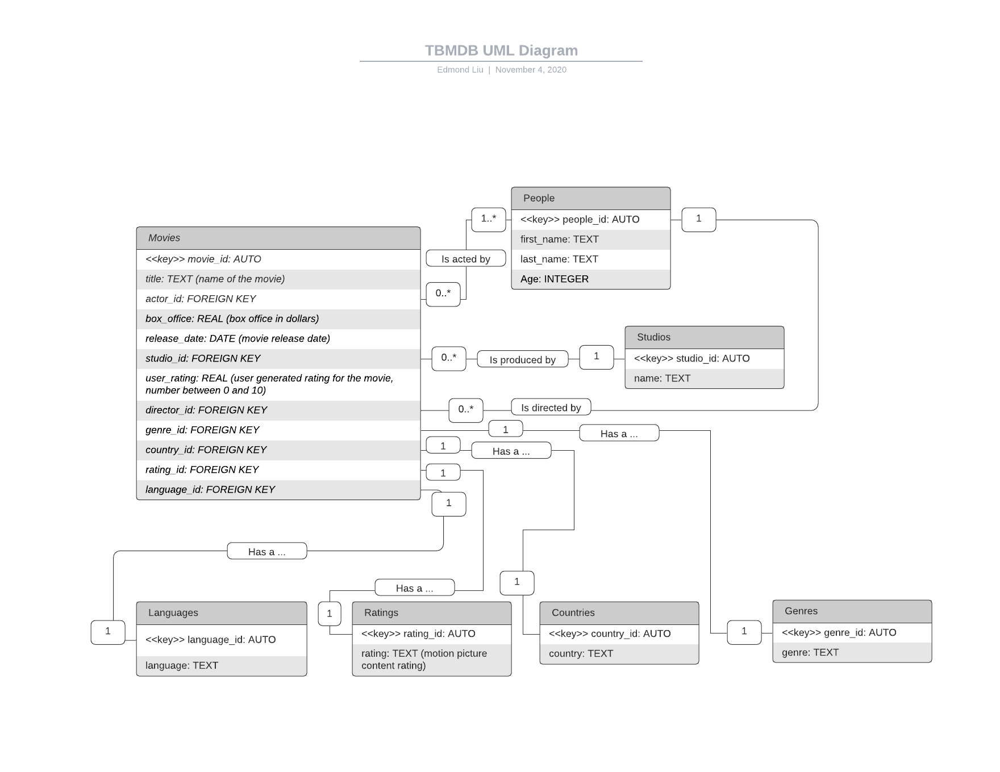

This is a lightweight database carrying data about movies, actors, and directors.

1. Requirements document: TBMDB_Requirements.pdf

2. Hiearchical Tables: Hiearchical_Tables.pdf

3. Collections: Main_Movie_Collection.pdf
   Check movies.json for sample movies documents that would be inserted to the database.

4. Data dump: movies.json and people.json. To initialize your database with these data points:

  a. create a JavaScript script that connects to your instance of MongoDB (locally or via Mongo Atlas), for example, if you are using a local instance:

  mongo TBMDB your_script_name.js

  b. in your_script_name.js, include the following commands:
    i. db.movies.insertMany(movies)
    ii. db.people.insertMany(people)

    where movies and people are data coming from movies.json and people.json. File I/O can be done with the readAsText() method.

5. Queries: Queries.pdf

6. Download this repository, then run the following commands:
  a. npm install
  b. npm run start
  
  then point your browser to localhost:3000.

UML Diagram:

ERD Diagram:

